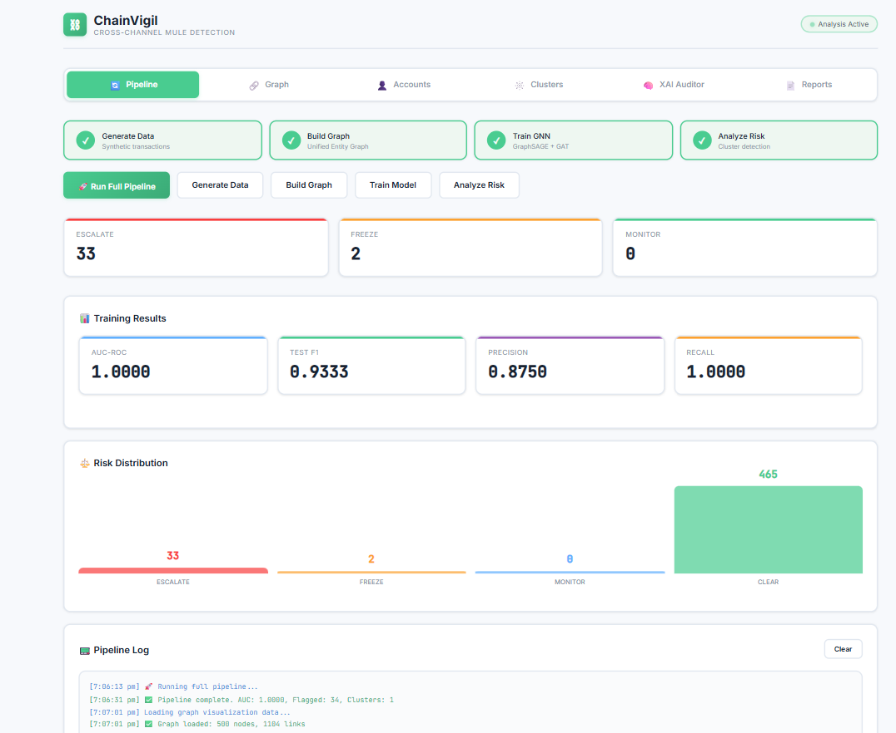
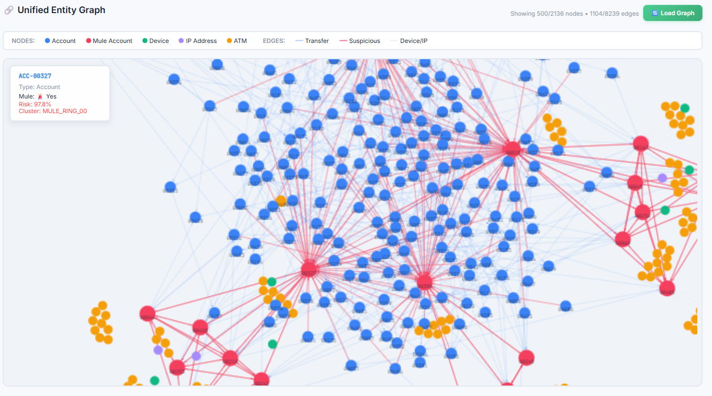
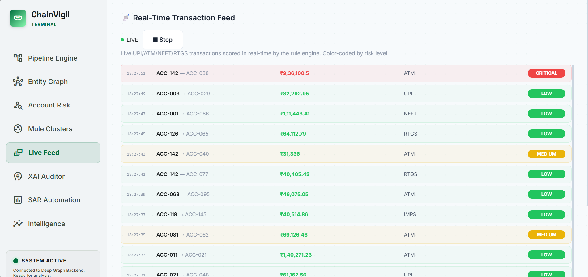
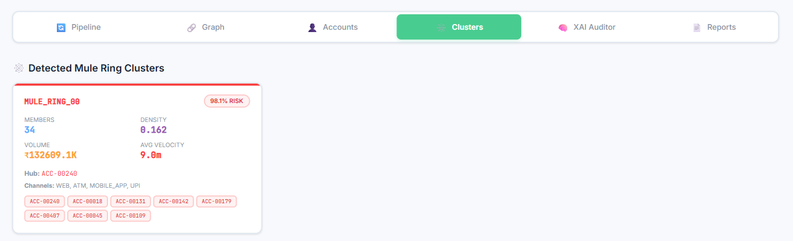
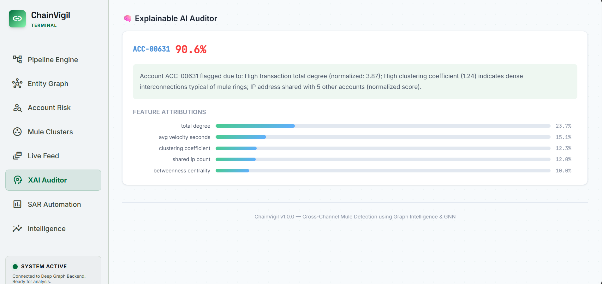
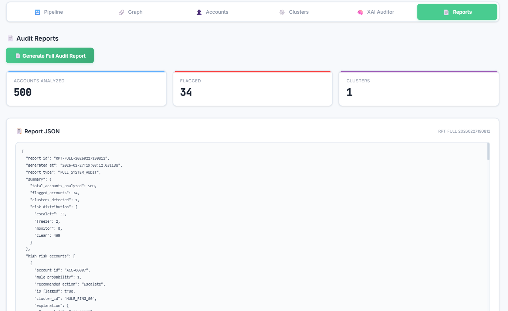

# ChainVigil 🔗⛓

**Cross-Channel Mule Detection using Graph Intelligence & GNN**

A graph-native financial crime detection system that identifies cross-channel money mule networks in near real-time. Integrates multi-source transaction logs (UPI, ATM, Web, Mobile App) into a Unified Entity Graph (UEG) and applies Graph Neural Networks to detect high-velocity fund movement and mule-ring clusters.

---

## 🏗️ Architecture

```
Multi-Channel Logs (App / ATM / UPI / Web)
  → Data Ingestion (FastAPI)
    → Unified Entity Graph (NetworkX + Neo4j)
      → Temporal GNN Scorer (GraphSAGE + GAT)
        → Risk Intelligence Engine
          → XAI Audit Reports
            → Dashboard (React)
```

## 🛠️ Tech Stack

| Component        | Technology                        |
|------------------|-----------------------------------|
| Backend / API    | FastAPI (Python)                  |
| Graph Database   | Neo4j + NetworkX                  |
| Machine Learning | PyTorch Geometric (GraphSAGE/GAT) |
| XAI              | Gradient × Input / SHAP           |
| Frontend         | React + Vite                      |
| Graph Viz        | react-force-graph-2d              |

---

## � Prerequisites


| Tool | Version | Download |
|------|---------|----------|
| **Python** | 3.10 or higher | [python.org/downloads](https://www.python.org/downloads/) |
| **Node.js** | 18 or higher | [nodejs.org](https://nodejs.org/) |
| **Git** | Any recent version | [git-scm.com](https://git-scm.com/) |

> **Note:** Neo4j is optional. The system automatically falls back to in-memory NetworkX graphs if Neo4j is not installed.

---

## 🚀 Setup & Run (Step by Step)

### 1. Clone the Repository

```bash
git clone https://github.com/YOUR_USERNAME/Mule-detection.git
cd Mule-detection
```

### 2. Install Backend Dependencies

```bash
pip install -r backend/requirements.txt
```

> **⚠️ PyTorch Note:** The `requirements.txt` includes `torch` and `torch-geometric`. If the install fails, install PyTorch manually first:
> ```bash
> # For CPU only (works on any machine):
> pip install torch --index-url https://download.pytorch.org/whl/cpu
> pip install torch-geometric
>
> # Then install the rest:
> pip install -r backend/requirements.txt
> ```

### 3. Start the Backend Server

Run this from the **project root folder** (not from inside `backend/`):

```bash
python -m uvicorn backend.main:app --reload --port 8000
```

You should see:
```
INFO:     Uvicorn running on http://127.0.0.1:8000
INFO:     Started reloader process
```

✅ **Backend is live at:** `http://localhost:8000`  
📄 **Swagger API docs at:** `http://localhost:8000/docs`

### 4. Install & Start the Frontend

Open a **second terminal** and run:

```bash
cd frontend-app
npm install
npm run dev
```

You should see:
```
VITE v5.x.x  ready in xxx ms
➜  Local:   http://localhost:5173/
```

✅ **Dashboard is live at:** `http://localhost:5173`

### 5. Run the Pipeline

1. Open `http://localhost:5173` in your browser
2. Click **"Run Full Pipeline"** (green button)
3. Wait ~1-2 minutes for all 4 phases to complete:
   - ✅ Generate synthetic data (500 accounts, 2500+ transactions)
   - ✅ Build the Unified Entity Graph
   - ✅ Train the GNN model
   - ✅ Run risk analysis & cluster detection
4. Explore the **Graph**, **Accounts**, **Clusters**, **XAI Auditor**, and **Reports** tabs

---

## 📡 API Endpoints

| Method | Endpoint                  | Description                          |
|--------|---------------------------|--------------------------------------|
| POST   | `/api/generate`           | Generate synthetic transaction data  |
| POST   | `/api/ingest`             | Build graph from generated data      |
| POST   | `/api/train`              | Train GNN mule detection model       |
| POST   | `/api/analyze`            | Run risk analysis & clustering       |
| POST   | `/api/pipeline/run`       | Run entire pipeline end-to-end       |
| GET    | `/api/graph/stats`        | Graph statistics                     |
| GET    | `/api/graph/visual`       | Graph data for visualization         |
| GET    | `/api/accounts`           | List accounts with risk scores       |
| GET    | `/api/accounts/{id}`      | Account details + neighbors          |
| GET    | `/api/clusters`           | List detected mule ring clusters     |
| GET    | `/api/clusters/{id}`      | Specific cluster details             |
| GET    | `/api/explain/{id}`       | XAI explanation for an account       |
| GET    | `/api/report`             | Generate full audit report           |
| GET    | `/api/export/anonymized`  | Privacy-preserving anonymized export |
| **POST** | **`/api/n8n/webhook`**  | **n8n webhook — score a transaction** |
| **POST** | **`/api/n8n/score`**    | **Direct account fraud scoring**     |
| **GET**  | **`/api/n8n/alerts`**   | **Recent fraud alert history**       |

---

## 🧠 How It Works

1. **Synthetic Data** — Generates realistic multi-channel transactions with embedded mule ring patterns (chain hops, hub-spoke, circular flows, smurfing)
2. **Graph Construction** — Builds a Unified Entity Graph with Account, Device, IP, ATM, and Transaction nodes with temporal edges
3. **Feature Engineering** — Computes 20+ features per account: velocity, centrality, clustering, channel diversity, shared devices/IPs
4. **GNN Model** — Hybrid GraphSAGE + GAT with class-balanced loss for semi-supervised mule detection
5. **Risk Engine** — Post-processing with cluster detection, velocity metrics, and action recommendations
6. **XAI Auditor** — Gradient-based feature attribution with human-readable explanations
7. **Privacy-Preserving Export** — SHA-256 hashed anonymized data sharing for inter-bank collaboration

---

## 🔒 Privacy-Preserving Inter-Bank Sharing

ChainVigil includes a built-in anonymization layer for sharing suspicious pattern data between financial institutions without exposing customer PII:

| What's Removed | What's Preserved |
|---------------|------------------|
| Account holder names | Graph topology (who connects to whom) |
| Bank names & countries | Risk scores & recommended actions |
| Device IDs & IP addresses | Behavioral features (degree, velocity, channel diversity) |
| ATM locations | Cluster memberships |
| Exact transaction amounts | Amount buckets (e.g., "5K-10K") |

**How it works:**
- Account IDs → SHA-256 hashed with a secret salt (`ACC-001` → `a3f8c2e1b9d04752`)
- Exact amounts → bucketed into ranges to prevent re-identification
- Device/IP/ATM data → completely stripped
- Graph structure + risk scores → fully preserved

**Endpoint:** `GET /api/export/anonymized`

---


## 🔗 n8n Fraud Alert Automation

An automated alert pipeline built with [n8n](https://n8n.io/) that wraps ChainVigil's detection engine into a production-ready workflow.

```
Webhook (Transaction In) → ChainVigil API (Fraud Score) → IF High Risk?
  ├─ YES → Format Alert → Email/Slack → Log to Google Sheets
  └─ NO  → Mark as Safe → Log to Google Sheets
```

### How It Works

1. **Webhook Trigger** — n8n listens for incoming transaction POSTs
2. **ChainVigil Scoring** — Calls `/api/n8n/webhook` with the transaction payload
3. **Risk Decision** — IF node checks `alert_triggered` (risk ≥ 0.70)
4. **Alert Dispatch** — High-risk → formatted email alert with XAI explanation
5. **Logging** — Every transaction logged to Google Sheets with score, level, and action

### Setup

1. **Import the workflow** — Open n8n → Import from File → select `n8n/n8n_fraud_alert_workflow.json`
2. **Configure environment variables in n8n:**
   - `CHAINVIGIL_API_URL` — Your ChainVigil backend URL (default: `https://metafazer-chainvigil.hf.space`)
   - `ALERT_FROM_EMAIL` / `ALERT_TO_EMAIL` — Email alert config
   - `GOOGLE_SHEET_ID` — Google Sheet for logging
3. **Enable disabled nodes** — Email and Google Sheets nodes are disabled by default (need credentials)
4. **Activate the workflow** — Toggle the workflow to active

### Test with the Simulator

```bash
# Send 10 simulated transactions (mix of normal and suspicious)
python n8n/simulate_transactions.py --count 10 --interval 1

# Send 25 transactions to n8n webhook
python n8n/simulate_transactions.py --count 25 --target n8n

# Custom URL and higher suspicious ratio
python n8n/simulate_transactions.py --url http://localhost:5678/webhook/chainvigil-transaction --suspicious-ratio 0.5
```


## 📸 Screenshots

### Pipeline Dashboard


### Interactive Graph Visualization


### Account Risk Scores


### Detected Mule Ring Clusters


### Explainable AI Auditor


### Audit Reports



---

## 🗂️ Project Structure

```
ChainVigil-Cross-Channel-Fraud-Intelligence-System/
├── README.md
├── ChainVigil_Documentation.md    # Full project documentation
│
├── backend/
│   ├── config.py                  # Settings (DB, GNN params, paths)
│   ├── main.py                    # FastAPI server (15+ endpoints)
│   ├── requirements.txt           # Python dependencies
│   ├── data/generator.py          # Synthetic data generator
│   ├── graph/builder.py           # Graph construction (NetworkX)
│   ├── graph/neo4j_client.py      # Neo4j client (optional)
│   ├── gnn/features.py            # 20+ feature engineering
│   ├── gnn/dataset.py             # NetworkX → PyTorch Geometric
│   ├── gnn/model.py               # GraphSAGE + GAT model
│   ├── gnn/train.py               # Training loop
│   ├── gnn/predict.py             # Inference & scoring
│   ├── risk/engine.py             # Cluster detection & risk analysis
│   ├── xai/explainer.py           # Gradient×Input explanations
│   └── xai/report.py              # Audit report generator
│
└── frontend-app/
    ├── package.json               # NPM dependencies
    └── src/
        ├── App.jsx                # Dashboard (6 tabs)
        └── index.css              # Light theme design system
```

---


## ⚠️ Troubleshooting

| Problem | Solution |
|---------|----------|
| `ModuleNotFoundError: No module named 'backend'` | Make sure you're running `uvicorn` from the **project root**, not from inside `backend/` |
| PyTorch install fails | Install PyTorch separately first (see Step 2 above) |
| `ENOSPC: System limit for file watchers reached` | Run `echo fs.inotify.max_user_watches=524288 \| sudo tee -a /etc/sysctl.conf` (Linux only) |
| Frontend shows CORS errors | Make sure the backend is running on port 8000 |
| Neo4j connection warning | This is normal — the system works fine without Neo4j |
| HuggingFace Space shows "Runtime error" | Go to Space Settings → click "Factory reboot" (transient DNS issue) |
